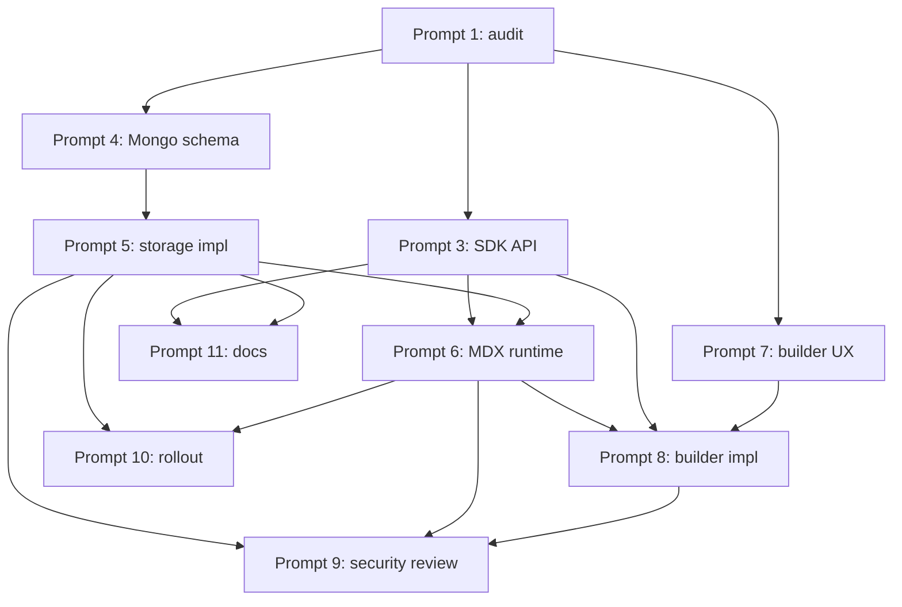

# Gap Analysis — Current Note Pipeline vs. MDX Mini-App Plugin

Baseline: `current-features.md`. Target: decisions table in the Prompts note.

## Target-by-target table

| Target capability | What exists today | Delta for v1 |
|---|---|---|
| New note type `mdx` dispatched alongside `markdown`/`image` | Electron renderer has a stub (`src/core/register-builtin-mdx-note-type.ts:17`); `WpnNoteDoc.type` is open-string (`db.ts:77`). Web-side dispatch is thin. | Add a web-side note-type registry in `apps/archon-web/app/mdx/` that mounts the runtime for `type === "mdx"`. |
| Client-side MDX compile with content-hash cache | `@mdx-js/mdx@^3.1.1` present; no compile wiring on the web. | New `apps/archon-web/lib/mdx/compile-cache.ts` using `dexie@^4.4.2`. |
| Expression sandbox (no `fetch`, no `window`, etc.) | `ses@^1.15.0` in deps; not used for MDX today. | New `apps/archon-web/lib/mdx/sandbox.ts` using SES `Compartment`. |
| SDK: `useProjectState`, `useNote`, `useQuery`, etc. | None. Existing `archon-mdx-facades` (Electron) has `@archon/ui`, `@archon/date` — good pattern to mirror. | New virtual module `@archon/mdx-sdk` surfaced to MDX compile. |
| Per-project KV state (chunked) in Mongo | Mongo pool, idempotent-migration system, auth middleware, permission resolver all exist. | New collections `mdx_state_head` + `mdx_state_chunks`. New `registerMdxStateRoutes(app)`. |
| Live updates via Change Streams → WebSocket | No WebSocket layer in Fastify. | Add `@fastify/websocket` (or raw `ws`) and a new ws handler that tails `mdx_state_head` change streams. |
| Drag-and-drop builder with human-readable MDX round-trip | `@dnd-kit/*` + `@uiw/react-codemirror` in deps; no builder code. | New `apps/archon-web/app/mdx/builder/*`. |
| Owner-only authoring | `permission-resolver.ts` + `space-auth.ts` already compute owner role. | Consume the same helpers from the new note-create flow and the builder mount gate. |
| State excluded from v2 bundles | `wpn-import-export-routes.ts` handles bundle IO; it does not touch state collections. | No change needed — state layer simply doesn't participate. |
| Read-only-on-import for non-owners | Import flow assigns `userId` to the importer; no readOnly flag today. | Add `metadata.readOnlyForImporter: true` when a non-owner imports `mdx` notes; the builder refuses to mount when set. |

## Dependency graph

Build order:

1. **SDK API + Mongo schema + builder UX** — can run in parallel; independent.
2. **MDX runtime + storage impl** — depend on 1.
3. **Builder impl** — depends on runtime + storage + UX spec.
4. **Security review** — audits everything produced in 1–3.
5. **Rollout + docs** — last, after everything else is stable.

## Reusable inventory

- **Auth**: `auth.ts:44-148` — token mint/verify, `requireAuth` middleware.
- **Mongo pool**: `db.ts:142` — single client, `getActiveDb()`.
- **Migration system**: `db.ts:303` (`_migrations` table) — add new `m_00x_mdx_state_indexes` here.
- **Permission resolver**: `permission-resolver.ts` — owner/reader/writer resolution.
- **Route aggregation**: `routes.ts:119` — add `registerMdxStateRoutes(app, …)` in that list.
- **App build**: `build-app.ts:19` — the place to register `@fastify/websocket`.
- **Virtual-module facade pattern**: `src/renderer/archon-mdx-facades/*` — mirror for web SDK.
- **SES**: already in deps; no install.
- **Bundle zip IO**: `archiver`, `unzipper`, `adm-zip` — state doesn't travel in bundles so we do nothing here.

## Conflict flags

- **No WebSocket layer in the sync-api today.** Fastify apps often deploy behind proxies that need sticky sessions for WS; flag for ops review.
- **Electron MDX stub vs. web MDX runtime.** Different surfaces, different owners. v1 diverges deliberately; unify in a later cleanup.
- **Web app thinness.** `apps/archon-web` today hosts only auth/invite/health. Adding a full builder + runtime roughly doubles that surface. Acceptable but worth flagging.
- **Replica-set assumption.** Change Streams + transactions require a replica set. If production Mongo is single-node, phase 3+ blocks.

## Review checkpoint

Human must confirm before Phase 3:
- Production Mongo is a replica set.
- Adding `@fastify/websocket` (or a `ws` adapter) to `apps/archon-sync-api` is acceptable.
- The `plugins/system/mdx-mini-app/` directory is the right home for the plugin manifest.
